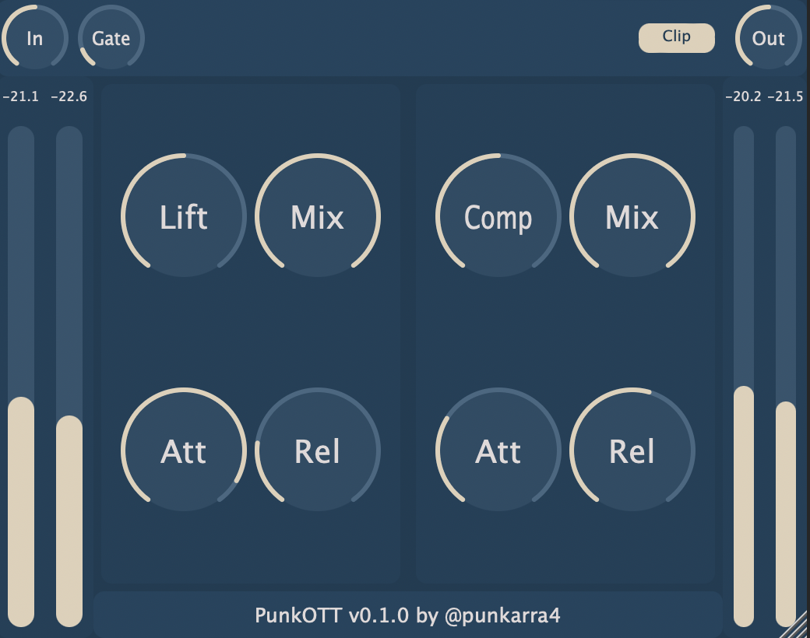

# PunkOTT
 

## Introduction
This is a VST3/AU OTT-style compressor plugin made with [JUCE](https://juce.com/). OTT stands for Over-The-Top, it is a very aggressive dynamic effect that combines upward compression (raises the level of quieter sounds, making them louder) and downward compression (lowers the level of louder sounds, limiting the peaks). This combination results in a dense, loud and harmonically rich sound; check the demo below to hear some practical examples.

--- THERE WILL BE A VIDEO LINK HERE WHEN THE DEMO IS READY ---

The original OTT compressor was developed in Ableton Live's Multiband Dynamics and Xfer Records replicated this effect in a [free plugin](https://splice.com/plugins/3788-ott-vst-au-by-xfer-records). My plugin is simply a curious attempt to recreate this chain of processes and give it my own spin.

## Work in progress
This is plugin is still under development. Here are some things I want to achieve before I conclude this mini project:
* **DSP**:
    * Lifter class is producing some annoying clips after silences. This should be treated as a *bug*.
    * _Mix_ parameter would better apply independently to the Lifter processor and the Compressor processor than to the sum of both processors.
    * APVTS listeners.
* **GUI**:
    * Resizeable layout. Right now, only some parts of the plugin window adjust when resizing...
    * Audio waveform visualizer. This is not really needed, but I want a fancy way of displaying how the plugin affects the signal.
* **Multiplatform availability**:
    * When I finish with the previous requirements, I will work on the `build.yml` file for building the plugin with GitHub Actions.
* **Extras**:
    * I am very happy with the code structure I am implementing with this plugin (you may call me a noob, but I am happy with it hahaha). I am tempted to create a new repository to save my Lifter, Compressor, Gate and Clipper classes, as well as any tool that I develop in the future.

## Inner Processing
I will update this section with a diagram of the DSP once it is done...
